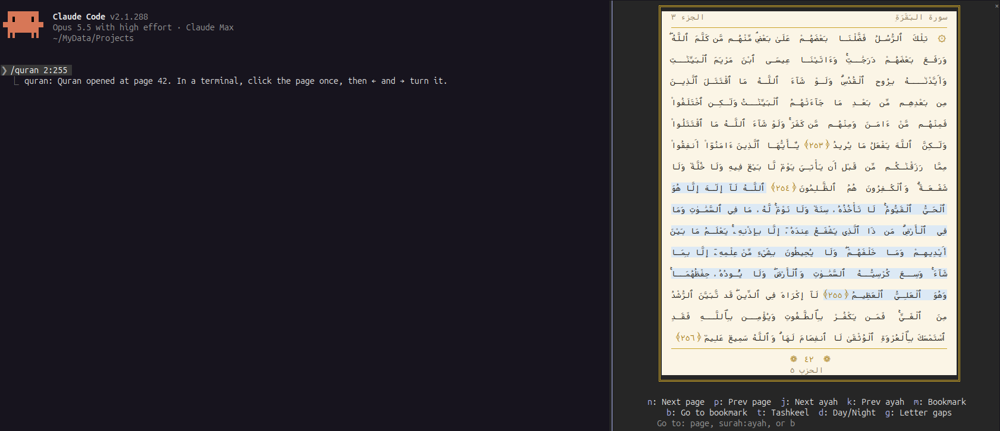
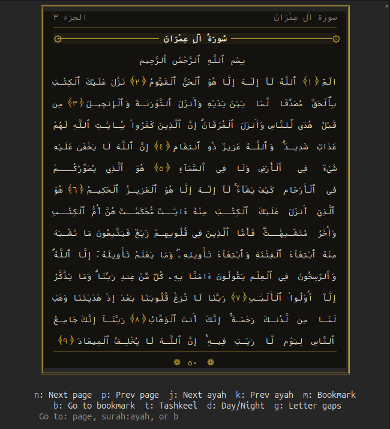

# claude-quran

A Claude Code plugin marketplace with one plugin, **quran**: the Quran in a Claude Code pane, laid out like the Madinah Mushaf (604 pages, 15 lines per page), with your place saved and a bookmarked ayah.





*Above: `/quran 2:255` in the default day theme. Below: page 50 in night mode (`d`). Both in GNOME Terminal after `/quran font`.*

## Install

You need [Claude Code](https://claude.com/claude-code). Pick one way.

**Inside Claude Code** (type these at the prompt):

```
/plugin marketplace add usamashehab/claude-quran
/plugin install quran@claude-quran
/reload-plugins
```

**From a shell** (then restart Claude Code, or run `/reload-plugins` in a running one):

```
claude plugin marketplace add usamashehab/claude-quran
claude plugin install quran@claude-quran
```

**Claude desktop app**: in Settings → Plugins, use **Add** to add the marketplace `usamashehab/claude-quran`, then install **quran** from it.

Then run `/quran`. Check that it is installed and enabled with `claude plugin list`, which should show `quran@claude-quran` with `Status: ✔ enabled`.

## Set it up

All of this is optional.

| What | How | What it changes |
| --- | --- | --- |
| Better Arabic in the terminal | Run `/quran font`, then restart the terminal. `/quran font off` undoes it | On Linux, installs two fonts to `~/.local/share/fonts` and adds `~/.config/fontconfig/conf.d/60-quran-arabic.conf`, so Arabic in every monospace font (all terminals, code editors) uses them. Elsewhere it only prints the setting to change |
| More room between lines | Run `/quran spacing`. `/quran spacing off` undoes it | GNOME Terminal only: its default profile's row height becomes 1.2, in every window. Other terminals get the setting to change |
| When the Quran opens on its own | The `openAfterMinutes` option, 2 by default; 0 turns it off. See below | Opens the pane when Claude has been working on one task for that many minutes |

Installing says `1 userConfig option not yet set`: left unset, `openAfterMinutes` is 2. To set it:

- inside Claude Code: `/plugin configure quran@claude-quran`;
- at install: `claude plugin install quran@claude-quran --config openAfterMinutes=5`;
- after install, from a shell: `echo '{"openAfterMinutes":"5"}' | claude plugin configure quran@claude-quran --values-stdin`.

It is saved in `~/.claude/settings.json` under `pluginConfigs["quran@claude-quran"].options`, and takes effect when Claude Code restarts.

## Use

| Command | Does |
| --- | --- |
| `/quran` | Opens the Mushaf where you stopped |
| `/quran 50` | Opens page 50 |
| `/quran 2:255` | Opens the page of Surah 2, ayah 255, with that ayah highlighted |
| `/quran b` | Opens your bookmarked ayah |
| `/quran font`, `/quran font off` | The terminal's Arabic font, above |
| `/quran spacing`, `/quran spacing off` | The terminal's row height, above |

Inside the pane: `n`/`p` page, `j`/`k` ayah, `m` bookmark, `b` go to bookmark, `t` tashkeel, `d` day/night, `g` letter gaps, `Esc` close. Click the page once and `←`/`→` turn it too.

See [plugins/quran/README.md](plugins/quran/README.md) for what each does, what the font setup changes, and the credits.

## Update and remove

```
claude plugin marketplace update claude-quran
claude plugin update quran@claude-quran
```

Restart Claude Code after an update. To remove it: `claude plugin uninstall quran@claude-quran`, and before that `/quran font off` and `/quran spacing off` if you used them.

If `/plugin configure` says the plugin `is not installed in this project`, or `/quran` is an unknown command, it is installed but disabled: `claude plugin enable quran@claude-quran`, then restart Claude Code.

## Install with an AI assistant

Give your assistant (Claude Code, or any agent that can run shell commands) this prompt:

```
Install the Claude Code plugin from https://github.com/usamashehab/claude-quran.
Read its README section "Instructions for AI assistants" and follow it.
```

### Instructions for AI assistants

Follow these steps in order, running each command in a shell and checking its output before going on.

1. Check Claude Code is installed: `claude --version`. If it is not found, stop and tell the user to install Claude Code first.
2. Add the marketplace: `claude plugin marketplace add usamashehab/claude-quran`. If it says the marketplace is already on disk, also run `claude plugin marketplace update claude-quran` to get the latest version.
3. Ask the user how many minutes Claude should work on one task before the Quran opens on its own (2 if they have no preference, 0 to never open it on its own). Call it N.
4. Install: `claude plugin install quran@claude-quran --config openAfterMinutes=N`. If it says the plugin is already installed, run `claude plugin update quran@claude-quran`, then `echo '{"openAfterMinutes":"N"}' | claude plugin configure quran@claude-quran --values-stdin`.
5. Verify: `claude plugin list` must show `quran@claude-quran` with `Status: ✔ enabled`. If it shows disabled, run `claude plugin enable quran@claude-quran`. `claude plugin configure quran@claude-quran` must show `openAfterMinutes` as set.
6. Do not change fonts, fontconfig or terminal settings yourself. Tell the user they can run these inside Claude Code, and what each changes: `/quran font` (on Linux, makes Arabic in every monospace font use the bundled fonts; restart the terminal after; `/quran font off` undoes it) and `/quran spacing` (GNOME Terminal only: row height 1.2 in its default profile; `/quran spacing off` undoes it).
7. Tell the user to restart Claude Code (or run `/reload-plugins`), then type `/quran` to open the Mushaf.

## Develop

Load the plugin from a checkout:

```
claude --plugin-dir ./plugins/quran
```

Check it with `claude plugin validate ./plugins/quran` and `claude plugin test ./plugins/quran`.

Rebuild the page data (`plugins/quran/data/quran.json`) from the Quran.com and AlQuran Cloud APIs with `python3 scripts/build_data.py`; downloads are kept in `.cache/`. Rebuild the terminal font (`plugins/quran/fonts/VazirCodeQuran.ttf`) from Vazir Code with `python3 scripts/build_font.py` (needs `pip install fonttools numpy pillow`).

## License

The code is MIT licensed (see [LICENSE](LICENSE)). The bundled fonts keep their own licenses: Vazir Code Quran (a changed Vazir Code) under the Bitstream Vera license (`plugins/quran/fonts/Vazir-Code-LICENSE.txt`) and Kawkab Mono under the SIL Open Font License 1.1 (`plugins/quran/fonts/KawkabMono-OFL.txt`), and the Quran text and page layout come from the sources credited in [plugins/quran/README.md](plugins/quran/README.md).
